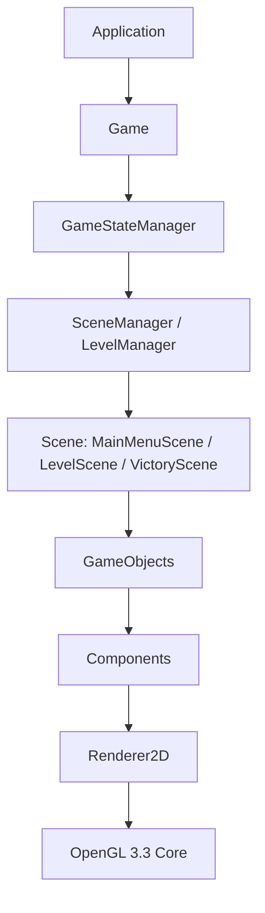
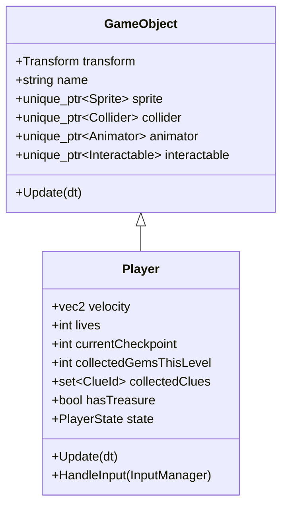
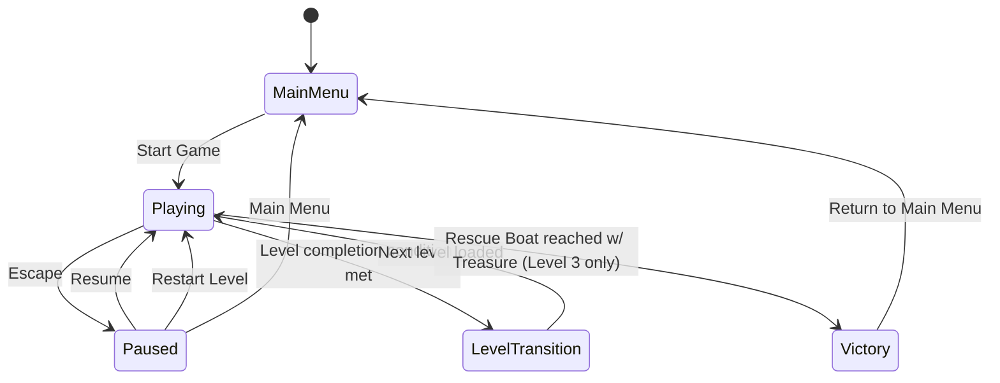
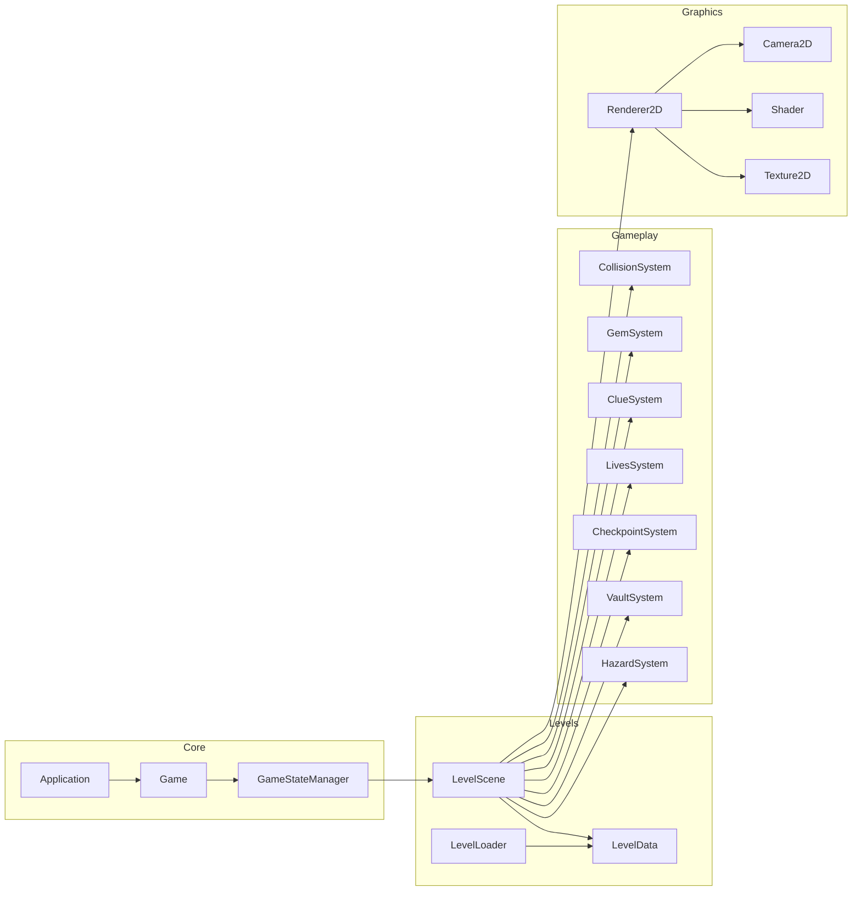

# Architecture.md — The Lost Vault (Technical Architecture)

> **Authority note:** This document defines *how the system is built*. For *what the game must do*, defer to `PRD.md`. For exact gameplay *behavior*, `Rules.md` is authoritative.

---

## 1. High-Level Architecture



- **Application**: owns the GLFW window, OpenGL context, and the top-level loop (timing, input polling, present).
- **Game**: owns global systems that outlive any single scene — `ResourceManager`, `AudioManager`, `SaveSystem`, `GameStateManager`.
- **GameStateManager**: a simple finite state machine: `MainMenu`, `Playing`, `Paused`, `LevelTransition`, `Victory`. (There is no separate persistent `GameOver` state — see `Rules.md` §Game Over Rules.)
- **SceneManager / LevelManager**: loads/unloads the active `Scene` (Main Menu scene, or a `LevelScene` for Levels 1–3, or the Victory scene) based on the current game state.
- **GameObjects**: lightweight entities composed of components (not a full ECS).
- **Components**: plain data + small behavior classes attached to GameObjects (Transform, Sprite/PrimitiveRenderable, Collider, Animator, etc.).
- **Renderer2D**: the only code that talks to OpenGL for drawing game content; batches draw calls by shader/texture.

## 2. System Architecture — Module Responsibilities

| Module (folder) | Responsibility |
|---|---|
| `core/` | Application bootstrap, main loop, timing (`Clock`), `Game`, `GameStateManager`, logging (`Log`), config loading (`Config`). |
| `graphics/` | `Renderer2D`, `Shader`, `Texture2D`, `Camera2D`, `Mesh`/`PrimitiveFactory`, `Font`/text rendering. |
| `gameplay/` | Gameplay systems: `GemSystem`, `ClueSystem`, `LivesSystem`, `CheckpointSystem`, `VaultSystem`, `CollisionSystem`, `HazardSystem`. |
| `entities/` | `GameObject`, `Component` base, concrete components (`TransformComponent`, `SpriteComponent`, `ColliderComponent`, `AnimatorComponent`, `InteractableComponent`), `Player`. |
| `levels/` | `Scene` base, `MainMenuScene`, `LevelScene`, `VictoryScene`, `LevelData` (data-driven level definitions), `LevelLoader`. |
| `ui/` | `HUD`, `PauseMenu`, `MainMenu` widget, `TextRenderer`, generic `UIButton`/`UILabel`. |
| `input/` | `InputManager` (GLFW key state polling + simple action mapping). |
| `audio/` | `AudioManager` abstraction (SHOULD HAVE; stubbed as no-op if audio backend is not yet implemented). |
| `utils/` | `AABB` math helpers, `Random`, `StringTable` (clue text), `FileUtils`. |
| `main.cpp` | Creates `Application`, calls `Run()`. |

## 3. Project Directory Structure

```
TheLostVault/
├── CMakeLists.txt
├── README.md
├── docs/
│   ├── PRD.md
│   ├── Architecture.md
│   ├── Rules.md
│   ├── Phases.md
│   ├── Design.md
│   └── Memory.md
├── assets/
│   ├── textures/
│   ├── fonts/
│   ├── audio/
│   ├── shaders/
│   │   ├── primitive.vert / primitive.frag
│   │   ├── sprite.vert / sprite.frag
│   │   └── text.vert / text.frag
│   └── levels/
│       ├── level1.lvl
│       ├── level2.lvl
│       └── level3.lvl
├── src/
│   ├── main.cpp
│   ├── core/
│   │   ├── Application.h/.cpp
│   │   ├── Game.h/.cpp
│   │   ├── GameStateManager.h/.cpp
│   │   ├── Clock.h/.cpp
│   │   ├── Config.h/.cpp
│   │   └── Log.h/.cpp
│   ├── graphics/
│   │   ├── Renderer2D.h/.cpp
│   │   ├── Shader.h/.cpp
│   │   ├── Texture2D.h/.cpp
│   │   ├── Camera2D.h/.cpp
│   │   ├── PrimitiveFactory.h/.cpp
│   │   └── Font.h/.cpp
│   ├── gameplay/
│   │   ├── CollisionSystem.h/.cpp
│   │   ├── GemSystem.h/.cpp
│   │   ├── ClueSystem.h/.cpp
│   │   ├── LivesSystem.h/.cpp
│   │   ├── CheckpointSystem.h/.cpp
│   │   ├── VaultSystem.h/.cpp
│   │   └── HazardSystem.h/.cpp
│   ├── entities/
│   │   ├── GameObject.h/.cpp
│   │   ├── Component.h
│   │   ├── TransformComponent.h/.cpp
│   │   ├── SpriteComponent.h/.cpp
│   │   ├── ColliderComponent.h/.cpp
│   │   ├── AnimatorComponent.h/.cpp
│   │   ├── InteractableComponent.h/.cpp
│   │   └── Player.h/.cpp
│   ├── levels/
│   │   ├── Scene.h
│   │   ├── MainMenuScene.h/.cpp
│   │   ├── LevelScene.h/.cpp
│   │   ├── VictoryScene.h/.cpp
│   │   ├── LevelData.h/.cpp
│   │   └── LevelLoader.h/.cpp
│   ├── ui/
│   │   ├── HUD.h/.cpp
│   │   ├── PauseMenu.h/.cpp
│   │   ├── MainMenuUI.h/.cpp
│   │   ├── TextRenderer.h/.cpp
│   │   ├── UIButton.h/.cpp
│   │   └── UILabel.h/.cpp
│   ├── input/
│   │   └── InputManager.h/.cpp
│   ├── audio/
│   │   └── AudioManager.h/.cpp
│   └── utils/
│       ├── AABB.h
│       ├── Random.h/.cpp
│       ├── StringTable.h/.cpp
│       └── FileUtils.h/.cpp
├── include/
│   └── (third-party single-header includes: stb_image.h, glad/, KHR/, etc.)
└── tests/
    ├── test_collision.cpp
    ├── test_levelloader.cpp
    └── test_gem_clue_rules.cpp
```

## 4. Class Responsibilities (Key Classes)

- **`Application`**: creates GLFW window + OpenGL context, owns the `Game` instance, runs the main loop (`Run()`), handles window resize and top-level GLFW callbacks, calls `glfwSwapBuffers`/`glfwPollEvents`.
- **`Game`**: owns `ResourceManager`, `AudioManager`, `SaveSystem`, `GameStateManager`, `InputManager`, `Renderer2D`. Exposes `Update(dt)` and `Render()` called each frame by `Application`.
- **`GameStateManager`**: holds current `GameState` enum (`MainMenu`, `Playing`, `Paused`, `LevelTransition`, `Victory`), exposes `RequestTransition(GameState)`, and owns/creates the active `Scene` via `SceneManager` on transition.
- **`Scene`** (abstract): `OnEnter()`, `OnExit()`, `Update(dt)`, `Render(Renderer2D&)`. Concrete: `MainMenuScene`, `LevelScene`, `VictoryScene`.
- **`LevelScene`**: owns the current level's `GameObject` list, `Player`, `Camera2D`, `HUD`, and the gameplay systems instances (`CollisionSystem`, `GemSystem`, `ClueSystem`, `LivesSystem`, `CheckpointSystem`, `VaultSystem`, `HazardSystem`). Drives per-frame `Update` order (see §6).
- **`LevelData`**: plain data struct loaded from a `.lvl` file — level bounds, tile/obstacle list, gem spawn list, clue spawn list, checkpoint list, hazard list, vault/treasure/boat definitions (Level 3 only), `gemsRequired`.
- **`LevelLoader`**: parses `.lvl` text files into a `LevelData`, and `LevelScene::BuildFromData` instantiates `GameObject`s from it.
- **`GameObject`**: id, name, `TransformComponent`, and a small fixed set of optional component pointers (not a generic component map, to keep it simple and cache-friendly): `sprite`, `collider`, `animator`, `interactable`. `Update(dt)` forwards to owned components as relevant.
- **`Player`**: specialized `GameObject`-derived class holding `velocity`, `facingDirection`, `lives`, `currentCheckpoint`, `collectedGemsThisLevel`, `collectedClues (set<ClueId>)`, `hasTreasure`, `state (Idle/Walking/Interacting)`. Implements hierarchical rendering (body/head/limbs as child transforms of a root transform).
- **`Camera2D`**: orthographic projection matrix + view matrix (translation only, no rotation), `Follow(target position, levelBounds)`.
- **`Renderer2D`**: `BeginScene(camera)`, `DrawQuad(transform, color)`, `DrawSprite(transform, texture, uv)`, `DrawText(...)`, `EndScene()` (flush batched draw calls). Owns the shared quad VAO/VBO/EBO and shader programs.
- **`CollisionSystem`**: AABB vs AABB sweep each frame between the player and static/dynamic colliders; resolves player position (axis-separated resolution) and raises collision events (gem pickup, hazard hit, checkpoint enter, vault/boat trigger enter).
- **`GemSystem` / `ClueSystem`**: hold references to remaining pickups in the active level, handle pickup-on-overlap, update counters, notify `HUD`.
- **`LivesSystem`**: owns life count for the current attempt, handles `LoseLife()` → respawn-or-restart decision (delegates to `CheckpointSystem`/`LevelScene::RestartLevel()`).
- **`CheckpointSystem`**: tracks the highest checkpoint reached; `GetRespawnPosition()`.
- **`VaultSystem`**: evaluates `UnlockCondition` each time a clue/gem count changes; on satisfy, flips vault state and spawns Treasure.
- **`HUD`**: reads read-only state from `Player`/`GemSystem`/`ClueSystem`/`LivesSystem` and renders via `Renderer2D`/`TextRenderer`.
- **`InputManager`**: wraps GLFW key callbacks/polling into a small `IsActionDown(Action)` / `WasActionPressed(Action)` API, decoupling gameplay code from raw GLFW key codes.
- **`ResourceManager`** (in `core/` or `graphics/`, singleton-free — owned by `Game`): caches `Shader`, `Texture2D`, `Font` by path so each asset loads once.

## 5. Rendering Pipeline

1. `Application::Run()` loop: poll input → `Game::Update(dt)` (state-machine-driven scene update) → clear framebuffer → `Game::Render()` (scene render via `Renderer2D`) → `glfwSwapBuffers`.
2. `Renderer2D::BeginScene(camera)` uploads the camera's `viewProjection` matrix (uniform) to the active shader(s).
3. Each visible `GameObject` submits one or more draw commands (quads/primitives) with its **world transform matrix** (`TransformComponent::GetWorldMatrix()`, composed with parent transforms for hierarchical objects).
4. `Renderer2D` batches quads sharing a shader+texture into a single dynamic VBO update + one `glDrawElements` call per batch (keeps draw calls low, per NFR performance budget).
5. UI/HUD is rendered last, in a separate orthographic **screen-space** projection (not the world camera), so it never scrolls with the level.

## 6. OpenGL Architecture

- Context: OpenGL 3.3 **core profile**, no legacy immediate-mode calls, no fixed-function pipeline.
- One shared **unit quad** VAO/VBO/EBO (positions + UVs) reused for all quads/sprites; per-object variation comes entirely from the uniform transform matrix + color/texture, not from re-uploading geometry.
- A second, simpler VAO/VBO for **flat-color primitives** built at load time by `PrimitiveFactory` (e.g., circle approximated by a triangle fan with N=24 segments — this is the project's "circle rasterization" teaching point) for things like gem facets, the sun, rocks.
- EBOs (index buffers) used for the shared quad (2 triangles / 4 vertices / 6 indices) to demonstrate indexed drawing.
- Uniform buffer usage kept simple: per-draw uniforms only (`u_MVP`, `u_Color`, `u_UseTexture`), no UBOs required (kept out to avoid unnecessary complexity for a student project).

## 7. Shader Architecture

| Shader | Purpose | Key Uniforms |
|---|---|---|
| `primitive.vert/.frag` | Flat-colored shapes (circles, polygons, UI rectangles) | `u_MVP` (mat4), `u_Color` (vec4) |
| `sprite.vert/.frag` | Textured quads (player, trees, chests, gems if textured) | `u_MVP` (mat4), `u_Texture` (sampler2D), `u_TintColor` (vec4) |
| `text.vert/.frag` | Bitmap-font text quads for UI/HUD | `u_Projection` (mat4, screen-space), `u_FontAtlas` (sampler2D), `u_TextColor` (vec4) |

All shaders are GLSL `#version 330 core`. Vertex shaders compute `gl_Position = u_MVP * vec4(a_Position, 0.0, 1.0);` (2D positions promoted to vec4 with z=0), explicitly demonstrating the model→view→projection transform chain.

## 8. Game Loop

- Fixed-timestep gameplay update at 60Hz (`dt = 1/60`) with an accumulator pattern in `Application::Run()`, decoupled from (uncapped or vsynced) rendering, to keep movement/collision deterministic regardless of frame rate.
- Pseudocode:
```cpp
double accumulator = 0.0;
double lastTime = glfwGetTime();
while (!glfwWindowShouldClose(window)) {
    double now = glfwGetTime();
    double frameTime = now - lastTime;
    lastTime = now;
    accumulator += frameTime;
    glfwPollEvents();
    while (accumulator >= FIXED_DT) {
        game.Update(FIXED_DT);
        accumulator -= FIXED_DT;
    }
    game.Render();
    glfwSwapBuffers(window);
}
```

## 9. Input System

- `InputManager::PollGLFWState(window)` called once per frame from `Application`, snapshots current/previous key states for the mapped keys (`W/A/S/D`, arrows, `Space`, `Enter`, `Escape`).
- Gameplay code queries `InputManager::IsActionHeld(Action::MoveUp)` etc. — never raw `GLFW_KEY_*` outside `InputManager`.
- `Action` enum: `MoveUp, MoveDown, MoveLeft, MoveRight, Interact, Pause, Confirm, MenuUp, MenuDown`.

## 10. Scene / Level System

- `Scene` is the abstract base for anything that owns a full-screen "mode": `MainMenuScene`, `LevelScene`, `VictoryScene`.
- `LevelScene` is parameterized by a `LevelId` (1–3) and loads the matching `LevelData` via `LevelLoader`.
- Level data files (`assets/levels/levelN.lvl`) use a simple, human-editable line-based text format (see `Design.md` §5 for the schema) — deliberately not JSON/XML to avoid pulling in a parsing dependency; a ~100-line hand-rolled parser is sufficient and is itself a good, explainable piece of code for evaluation.
- Level transition: `LevelScene` signals completion (via `GameStateManager::RequestTransition(LevelTransition)`) when its completion condition (from `Rules.md`) is met; the `LevelTransition` state briefly shows a card, then loads the next `LevelId` (or `Victory` after Level 3's Rescue Boat trigger).

## 11. Entity System

- Composition, not inheritance-heavy OOP and not a generic ECS: `GameObject` has a small **fixed** set of optional component slots (`unique_ptr` members), chosen because the object catalog for this game is small and known ahead of time (player, gem, clue, hazard, static obstacle, checkpoint, vault, treasure, boat, exit-trigger).
- `Player` is a dedicated subclass (not just a `GameObject` with components) because its behavior (movement, life/checkpoint/clue/treasure state) is unique and central enough to warrant its own class — this is an explicit, documented exception to "prefer composition."



## 12. Collision System

- All colliders are **AABBs** in world space (`utils/AABB.h`), computed from `TransformComponent` position/scale + a per-`ColliderComponent` half-extent.
- Static geometry (trees, rocks, walls, water edge) is collected once per level load into a spatial list (simple vector; a grid/quadtree is explicitly **not** needed at this game's scale, per Non-Goals).
- Per fixed-update: (1) integrate player velocity into a candidate position, (2) axis-separated AABB resolution against static colliders (resolve X, then Y, to avoid corner-catching), (3) overlap tests against dynamic trigger volumes (gems, clues, checkpoints, hazards, vault/boat) which are **not** physically solid (trigger-only, no position correction).

## 13. Camera System

- `Camera2D` holds an orthographic projection (`glm::ortho(0, viewWidth, 0, viewHeight, -1, 1)`) sized to the window in world units (`viewWidth/Height = windowSize / PixelsPerUnit`).
- View matrix is a pure translation to `-playerPosition + halfViewSize`, then clamped so the visible rectangle never extends past `LevelData::bounds`.
- No camera rotation or zoom in v1 (kept simple; see Future Improvements for zoom).

## 14. UI System

- Two render passes: world-space (`Renderer2D` with world camera) then screen-space (separate orthographic projection fixed to window pixels, `0..windowWidth, 0..windowHeight`).
- `HUD`, `PauseMenu`, `MainMenuUI` are simple classes composed of `UILabel`/`UIButton` primitives drawn via the `text` and `primitive` shaders in screen space.
- `TextRenderer` uses a baked bitmap font atlas (generated once at build/asset-prep time via `stb_truetype`, stored as a PNG + metrics file in `assets/fonts/`) — avoids linking a full font-rendering library like FreeType.

## 15. Asset / Resource System

- `ResourceManager` (owned by `Game`) exposes `GetShader(name)`, `GetTexture(path)`, `GetFont(name)` — each loads-once and caches by key; returns a non-owning reference/pointer valid for the process lifetime.
- Assets referenced by relative path from `assets/`, resolved at runtime relative to the executable's working directory (documented in `Memory.md` build/run instructions).

## 16. Game State System



## 17. Save / Progression System (SHOULD HAVE)

- `SaveSystem` writes a tiny plaintext file `save.dat` (single line: `highestUnlockedLevel=<n>`) to a writable directory next to the executable.
- Loaded at startup by `Game`; `MainMenuScene` shows "Continue" only if `highestUnlockedLevel > 1`.
- Absence/corruption of the save file is non-fatal: falls back to `highestUnlockedLevel = 1` and logs a warning.

## 18. Audio Abstraction (SHOULD HAVE)

- `AudioManager` interface: `PlaySfx(SfxId)`, `PlayMusic(MusicId, loop)`, `StopMusic()`, `SetMuted(bool)`.
- Backed by a minimal header-only library (e.g., `miniaudio.h`) if implemented; if audio is deferred, `AudioManager` methods are present but no-op, so gameplay code never needs to change.

## 19. Error Handling

- `Log::Error/Warn/Info` macros write to stderr/log file with `[LEVEL][module] message`.
- Fatal init errors (window/context creation failure, shader compile failure) throw a `std::runtime_error` caught in `main.cpp`, logged, and exit with non-zero code.
- Non-fatal runtime errors (missing texture, malformed level file) log a warning and fall back to a safe default (magenta placeholder texture; empty level object list) rather than crashing.

## 20. Logging

- Single header `core/Log.h` with compile-time-toggleable verbosity (`LOG_LEVEL` define), writing to stdout in debug builds and to `logs/game.log` in release builds.

## 21. Configuration

- `core/Config.h/.cpp` loads a small `config.ini`-style file (window size, fullscreen flag, master volume) with hardcoded sane defaults if the file is absent — no dependency on a config-parsing library (hand-rolled key=value parser, ~40 lines).

## 22. Testing Strategy

- Lightweight unit tests (no heavy framework required; a small header-only `catch2`-style single-header runner or hand-rolled `assert`-based test runner is acceptable) covering:
  - `AABB` intersection math.
  - `LevelLoader` parsing of a sample `.lvl` file.
  - `VaultSystem` unlock-condition evaluation (clue combinations, gem thresholds).
  - `LivesSystem` respawn vs. restart transition logic.
- Manual playtest checklist (see `Phases.md` per-phase acceptance criteria) covers integration-level verification (full level playthroughs).

## 23. Build System

- CMake ≥ 3.16, single top-level `CMakeLists.txt`.
- Dependencies fetched via `FetchContent` (GLFW, GLM) or vendored (GLAD generated sources committed under `include/glad/` + `src/glad.c`, `stb_image.h` vendored under `include/`).
- Targets: `TheLostVault` (main executable), `TheLostVaultTests` (test runner), both linking a shared `TheLostVaultCore` static library containing everything except `main.cpp`/test mains, to keep test builds fast and avoid duplicate compilation.

## 24. Dependency Management

| Dependency | Purpose | Integration |
|---|---|---|
| GLFW | Window, context, input | `FetchContent` |
| GLAD | OpenGL 3.3 core loader | Vendored generated source |
| GLM | Vector/matrix math | `FetchContent` (header-only) |
| stb_image.h | Texture loading (PNG) | Vendored single header |
| stb_truetype.h | Font atlas baking (offline/tool step) | Vendored single header |
| miniaudio.h (optional) | Audio playback | Vendored single header, only if FR-14 is implemented |

## 25. Important Data Flows

**Gem pickup flow:**
`Player moves → CollisionSystem detects overlap with Gem GameObject trigger → GemSystem::OnGemCollected(gemId) → remove GameObject from LevelScene, increment Player::collectedGemsThisLevel & global counter → HUD refresh → VaultSystem re-evaluates unlock condition (Level 3)`

**Hazard/death flow:**
`Player overlaps Hazard trigger → HazardSystem::OnHazardHit() → LivesSystem::LoseLife() → if lives > 0: teleport Player to CheckpointSystem::GetRespawnPosition(), reset velocity → else: LevelScene::RestartLevel() (reload LevelData, reset Player state for this level)`

**Vault/Treasure/Victory flow:**
`Clue or gem collected → VaultSystem::Evaluate() → if condition met and not already unlocked: Vault.state = Unlocked, spawn Treasure GameObject → Player collects Treasure → Player::hasTreasure = true → RescueBoat trigger becomes active → Player overlaps + interacts → GameStateManager::RequestTransition(Victory)`

## 26. Diagram — Full Object/Module Dependency



This architecture is the binding reference for `Phases.md` task breakdown and `Memory.md` implementation-status tracking.
